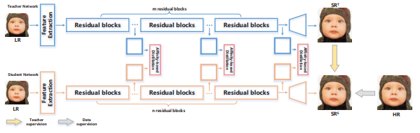
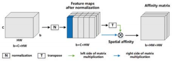

# Knowledge Distillation SuperResolution
  
최신기술의 SR 네트워크를 살펴보면 깊고, 넓은 네트워크를 이용하여 성능을 높이고 있습니다.  
하지만 이러한 네트워크는 모바일이나 Edge 환경에서 사용하기가 매우 어렵습니다.  
Knowledge Distillation (지식 증류)의 목표는 같은 구조의, 파라미터 개수가 적은 경량화된 네트워크를 원본 네트워크의 성능에 근접하게 하는 것입니다.  
이와 관련된 논문이 FAKD 입니다.  
이 글은 FAKD 논문 내용과 오픈소스를 인용하여 작성하였습니다.  

## Second-Order Information  
대부분의 SR 네트워크는 첫 번째 우선순위의 Feature map 에서 특징을 가져옵니다.  
하지만 이 과정에서 여러 정보들이 무시가 됩니다.  
이러한 이유로 FAKD 에서는 두 번째 우선순위의 Feature Maps 를 사용합니다.  

## Spatial Loss  
지식 증류의 가장 중요한 열쇠는 Student 모델에게 가치있는 정보를 전달 해주는 적절하게 모방된 Loss 함수를 설계하는 것 입니다.  
기존 증류기법의 Loss 함수는 그 범위가 한정되어있지 않고 Solution Space 가 크다는 특징이 있고 이러한 방식은 SR 네트워크에 적합하지 않습니다.(분류에서는 사용 중)  
이러한 이유로 FAKD 에서는 SR 네트워크에 적합한 새로운 Loss 함수를 제안합니다.  
  
우선 입력받은 텐서를 3차원 텐서로 변환합니다.  
변환 결과는 ```배치사이즈, 채널, 폭x높이``` 가 됩니다.
또한 통합된 Feature maps를 얻기 위해서 affinity matrix A를 계산합니다.  
그리고 코사인 유사도를 계산합니다.  
최종적인 형태는 ```배치사이즈, 폭x높이, 폭x높이``` 가 됩니다.  

## Teacher Supervisions (TS), Data Supervisions (DS)  
Spatial Loss 를 사용하다가 TS, DS 또한 증류 기법의 성능을 향상시키는데 도움이 됩니다.  
Student 모델에서 나온 결과를 Teacher 모델과 원본 이미지 각각과 비교를 합니다.  
이러한 원리로 Student 모델은 Teacher 모델로 부터 정보를 받는 과정을 최적화 할 수 있습니다.  

## 사용 가능한 Loss
- Spatial Loss (SA)


## 사용 방법
기본적으로 해당 코드는 라이브러리를 불러오는 형태로 작동합니다.  
또한 사용자 정의의 Training 코드가 존재해야 하며 해당 코드에 이식해서 사용하는 방식입니다.  

1. 라이브러리를 불러오고 KDS 클래스의 객체를 생성합니다.
```
from KDS import KDS
kds = KDS()
```
  
2. 모델의 forward 부분에 feature map을 추가합니다. 아래는 예시입니다.  
```python
def forward(self, x)
feautre_maps = []
x = first_part(x)
feautre_maps.append(x)
x = second_part(x)
feautre_maps.append(x)
x = final_part(x)
return feature_maps, x
```  

3. 기기를 등록한다.  
```python
device = torch.device("cuda:0")
kds.setDevice(device)
```

4. 선생님 모델을 생성하여 등록한다  
이 때, 선생님 모델은 weights 값이 불러와진 상태여야 한다.
```python
kds.setTeacher(teacher_model)
```

5. 학생 모델을 생성하여 등록한다  
Optimizer 기본으로 Adam으로 설정된다.  
``` python
kds.setStudent(student_model)
```

6. 데이터 셋, 데이터 로더 등을 생성한다.  

7. Loss 옵션을 설정한다.  
```python
kds.setLoss(SA=True)
```  

8. Optimizer(최적화 함수)를 따로 설정하고 싶을 경우 생성하고 등록한다.  
```python
kds.setOptimizer(optim)
```  

9. 1 iterater 만큼 학습을 진행 한다.  
통상 데이터로더를 통해 데이터를 불러오는데, 불러온 데이터를 모델에 매개변수로 주지 말고 아래 함수를 사용한다.  
해당 과정에서 Loss 측정 및 Weights 갱신등이 자동으로 진행된다.
```python
kds.train(lr, hr)
```

10. 원하는 순간에 모델을 저장한다.  
```python
kds.saveStudentModel(path)
```